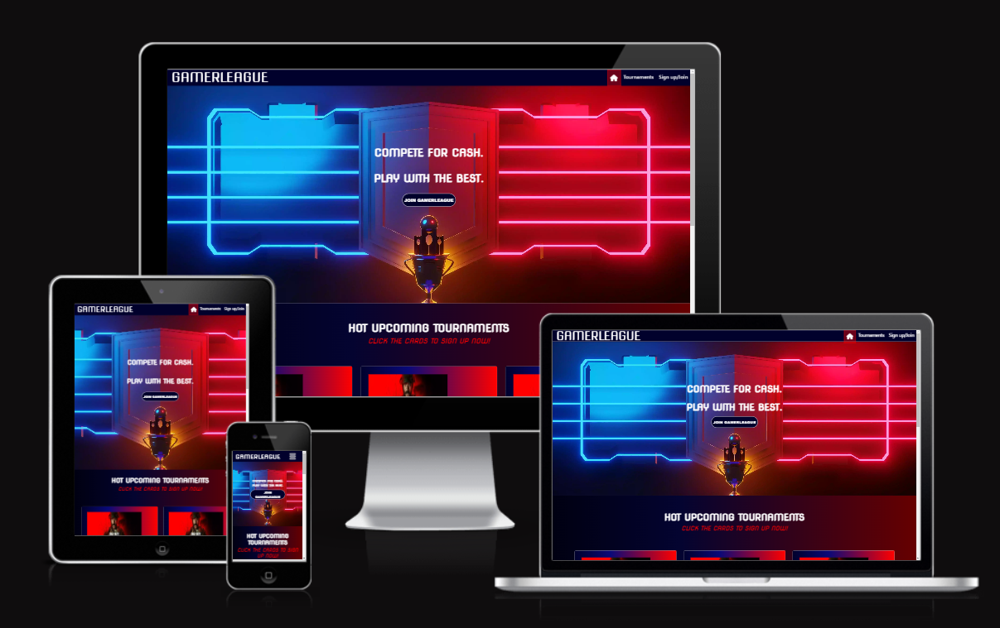
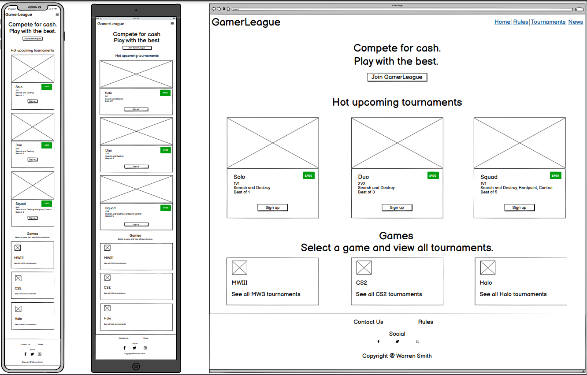
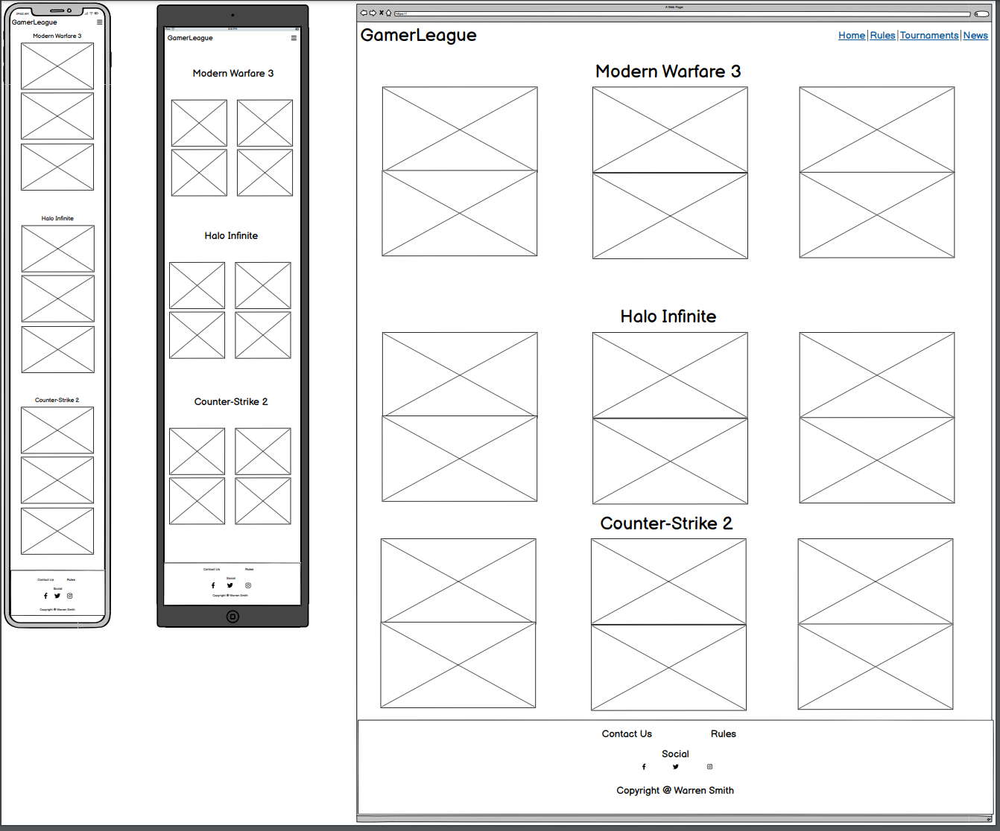
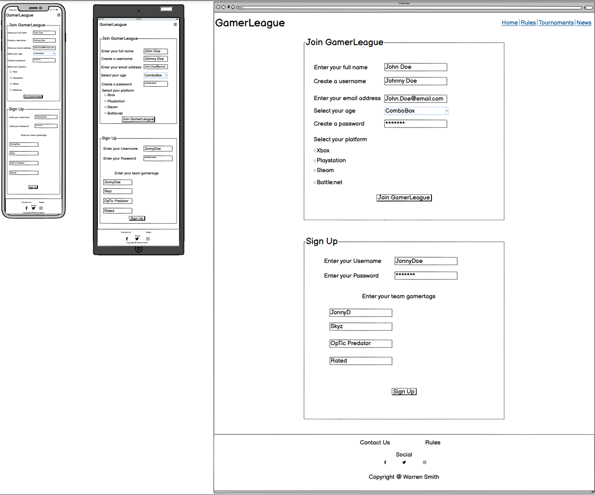
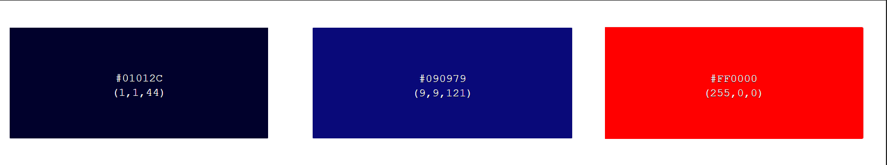
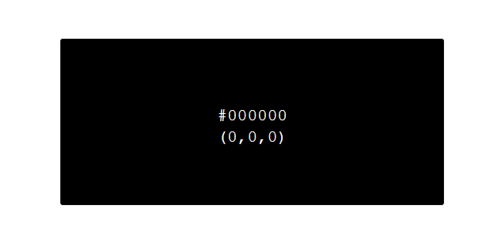
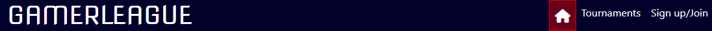
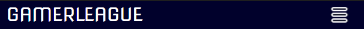
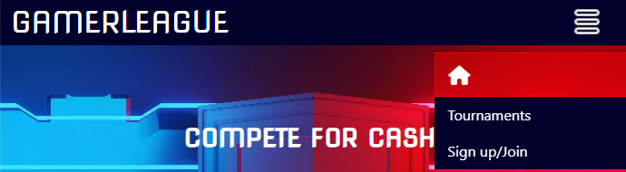

# GamerLeague

GamerLeague are a group of competitive gamers ranging from amateur to professional level. Our aim is to provide gamers a competitive setting to compete at the highest level. 

Anyone is able to join the league via the form application on the join us page. You can also sign up for any Solo, Duo and Squad events. In the tournament section you will find a gallery of recent tournaments held. You can also contact us if you have any issues via the contact us section in the footer. Here you fill our your details and submit any issues you have. You can also find links to our socials.

 

[You can visit the GamerLeague website here](https://wxrren.github.io/1st-milestone-project-GamerLeague/)
------

## Table of Contents

### [User Experience (UX)](#user-experience-ux)
* #### [User Stories](#user-stories)
* #### [WireFrames](#wire-frames) (View the repository [here](https://github.com/Wxrren/1st-milestone-project-GamerLeague/tree/main/ux/wireframes))
* #### [Design](#design-1)

### [Features](#features-1)
* #### [Existing Features](#existing-features-1)
* #### Discontinued features
* #### Development images

### Testing
* #### Validation Results
* #### Manual Testing
* #### Lighthouse Report

### Deployment and local development
------

## User Experience (UX)

The goal of the website is to attract gamers of all levels who would like to compete in a game of their choice. 

There is a clear naviation in the nav bar which directs you on where to join the league or sign up to competitions. It also directs you to a tournaments gallery where they can look at pictures of tournaments others have competed in.

Users can also contact GamerLeague if they have any issues either with the site, a tournament or player - whatever it may be. They can follow the contact us link in the footer and submit their issue.

To make the user experience easy - I wanted the site to have:

* A simple call to action on the main screen with a join GamerLeague button. This will take you directly to a single contact page - Even though this navigation exists on the nav bar - the aim is this button in the center of the screen next to the tagline will motivate gamers to join. 
* A card displaying the tournaments that could be clicked on to redirect you to a the same contact page as the join button - the sign up section is on the lower part of the page. The idea is to have one single contact page that makes it a quicker and easier experience for the user.

## User Stories
To determine which approach to take with site features I detirmined the goals of different users from first time through to frequent users.

### User

* First time User Goals
    * As a user I want to be able understand the main purpose of the site immediately and learn more about the GamerLeague.
    * As a user I want to be able to see what upcoming tournaments are available.
    * As a user I want to be able to easily navigate the site.
    * As a user I want to be able to find how to join the site and do so easily.

* Returning User Goals
    * As a user I want to be able to see hot upcoming tournaments and sign up quickly.
    * As a user I want to be able to easily contact the company should issues arise.
    * As a user I want to be able to view the gallery of recent or previous tournaments for nostalgia or to see what I missed if not attending.
    
* Frequent User Goals
    * As a user I want to be able to see if there is any new upcoming tournaments and sign up quickly.
    * As a user I want to be able to review the gallery and see new photos of recent tournaments
    * As a user I want to see the latest information coming in from pro's or breakdown the latest tournaments with an experience cast.

    ## Wire Frames

    When designing this website I intended the site to have a very minimal design that was easy to spot what was relevant information and how to navigate to where they wanted to be. 

    I have made some changes during the creation of the website. These changes were to the [Home Page](#home-page---wireframe-for-desktop-tablet-and-mobile), [Gallery Page](#gallery-page---wireframe-for-desktop-tablet-and-mobile) and the [Join Page](#join-page---wireframe-for-desktop-tablet-and-mobile)

### Home Page - Wireframe for Desktop, Tablet and Mobile.

* Home page changes

For the home page I was going to initially have 3 cards showing a different game - once clicked these would take you to a page with more dummy tournaments similar to the "upcoming tournaments" section - After discussing this with my mentor we agreed it was a bit too much and to keep it simple. Instead I opted fo the multiple games to be shown in the gallery page and use the games section instead to give more identity and content to the site. I chose to do an about us section with a brief description of the team behind the site and then embedded 2 videos to give the website a professional identity. One was a tutorial from a professional coach in ESports and another was a breakdown of a recent Esports tournament on a talkshow held by retired Esports pros. I felt this would help give the site an identity of a professional gaming league.

### Gallery Page - Wireframe for Desktop, Tablet and Mobile.

* Gallery page changes

During the creation of the gallery page I had intended to have a page with 3 sections showcasing tournaments for different games. When putting this together I decided I didn't like the idea of seperating the games as I wanted the gallery to be a page showcasing the GamerLeagues tournaments and work. I instead opted to make it one single pages with the images split into collumns. 3 for Desktop, 2 for Tablet and 1 for Mobile. I then showcased different Esports tournament images - the intention was to showcase the GamerLeague as a professional tournament league and the gallery can be their body of work.

### Join Page - Wireframe for Desktop, Tablet and Mobile.

* Join Page changes

The changes for the join page were more minimal. After discussing with my mentor Mitko we agreed on having one single contact page split into sections. The top section you can join the league and the bottom you can sign up for tournaments. As I had made the dummy tournaments a "solo", "Duo" and "Squad" it would mean that the sign up form for a solo or duo would only require one or two gamertags. I thought this would look out of place so I decided to make 3 seperate fieldsets in the signup section for each different tournament type. This also then allowed me to make the gamertags a required field that all had to be filled in order to sign up.  

## Design

### Color

The theme I wanted for the website was Red VS Blue. The colours would help to represent competition and they're also used as a reference to an old video series called Red Vs Blue by Machinima.

I chose a Red and blue image that I wanted to be used at the top of the home page and then set a linear gradient of blue to red for the background of the page to match the colours in the picture. I then felt this was too bright and could impact visibility on the site so I added a slight black opaque overlay to make the blue and reds appear a little darker and the content on the website look more visible. 

For the cards on the home page - I chose to keep these without the overlay to stand out from the background and draw the user's eye to them.

* Main colours used on the website:
    
    * #01012c - Used for the Nav bar as it a darker and bolder colour to separate it from the main image on the homepage and the blue and red colours below. This is also used on the main background colour as part of the linear gradient. The black overlay helps darken this a bit more and separate it from the header.
    * #090979 - this is used as the middle part of the gradient to get a transition from dark blue to light blue to red. It helps lighten up the middle portion.
    * #FF0000 - The end part of the gradient. Once mixed in a gradient witht he blue this helps give us the red vs blue theme and make it look like the colours are clashing in the middle 

* Overlay colour: 

 

* #000000 - Used as a transparent overlay with RGBA code rgba(0, 0, 0, .6). This helped make the blue and reds appear a little darker so that the content can stand out more.

### Typography

* Nova Square 
    
    * I chose Nova Square as the main font from google fontsas I felt it meshed well with a gaming brand due to the style of the lettering and the boldness of the text to stand out. I also had Sans serif as a back up in case this didn't work.

* Sans Serif

    *  I had Sans Serif for 2 uses. I  had it as a back up in case Nova Square didn't work. I also used it for the Nav bar, buttons and general info as I felt a clear and simple font would make it easiest to take in information and navigate the site.

### WireFrames

I created my wireframes using balsamiq wireframes. I found this simple and effective for coming up with how I wanted the site to look as it had a variety of ready available tools representing different parts of a website so I was able to design it how I envisioned it in my head.

## Features
* This website is targeting people looking to compete in game tournaments for cash prizes
* They can do this by joining the League and signing up to tournaments on the join page.
* Responsive on all device sizes.

### Existing Features

#### Navigation bar

* The Nav bar is fixed to the top of every every page including the contact us page reachable through the footer.
* The Nav bar includes links to the Home page, Tournaments page and the Signup/Join page. Where you are on the site can be easily identified by these links as your current active page will be highlighted by a red border/background colour as well as a larger font at all times. You can also see which page you are hovering over because each link has a similar effect to the active page where it will turn red and the font will become larger.
* The Nav bar design is intenticle across every page.
* The Nav bar allows you to easily explore the site by clicking each page at the top allowing you to get to and from each page without needing the backwards and forwards browser buttons. 
* The Nav bar also has a mobile view consisting of a hamburger icon. Once selected this will bring a dropdown list of the pages as show below: 

